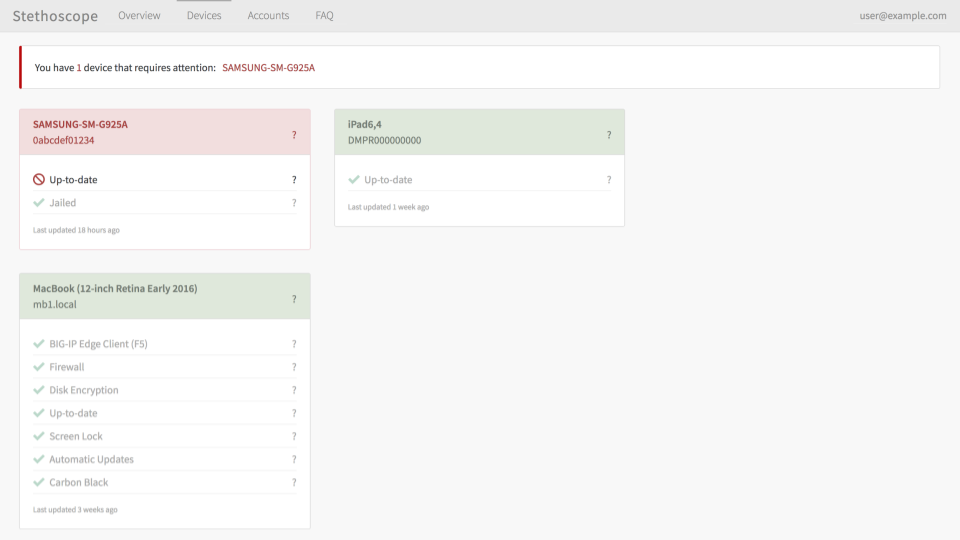

# Stethoscope: User-Focused Security


Stethoscope is a web application that collects information from existing device data sources (e.g.,
JAMF or LANDESK) on a given user’s devices and gives them clear and specific recommendations for
securing their systems. An overview is available on the [Netflix Tech
Blog](http://techblog.netflix.com/).

[](https://gitter.im/Netflix-Stethoscope/Lobby?utm_source=badge&utm_medium=badge&utm_campaign=pr-badge&utm_content=badge)
[](http://www.apache.org/licenses/LICENSE-2.0)
[]()
[](https://travis-ci.org/Netflix/stethoscope)



## Quickstart

If you have [node] (version 6.4+) and npm (included with node) installed already and just want to play around with the front end, run:

`make install-develop-ui`


## What is Stethoscope?

### Main Features

- Retrieves device information from:
  - JAMF
  - LANDESK
  - G Suite (Google) Mobile Management
  - bitFit
- Evaluates status of various security practices, including:
  - Disk encryption
  - Firewall
  - Screen saver lock/password
  - Operating system up-to-date
  - Operating system auto-update
  - Not jailbroken/rooted
  - Software presence (e.g., for monitoring tools)
- Merges associated device records
- Plugin architecture:
  - Easy to add data sources, practices, and other components
  - Examples and base plugins for communicating with Elasticsearch and HTTP REST APIs

## Getting Started

Stethoscope consists of two primary pieces: a Python-based back-end and a React-based front-end.
Nginx is used to serve static files and route traffic to the back-end.

The easiest way to get up-and-running quickly is through the provided Docker configuration.

### Docker

To run with [Docker](https://www.docker.com/), first install Docker
([standard](https://docs.docker.com/mac/) or [beta](https://beta.docker.com/)).

We have provided a [Docker Compose](https://docs.docker.com/compose/) file, `docker-compose.yml`,
that defines the services that make up Stethoscope. To start these services, run:

```sh
docker-compose up
```

Then connect to the main Nginx web server at `http://localhost:5000`.

#### Troubleshooting

If you encounter the following error, you likely need to upgrade `docker-compose` to version 1.10 or
higher.

> ERROR: In file './docker-compose.yml' service 'version' doesn't have any configuration options.
> All top level keys in your docker-compose.yml must map to a dictionary of configuration options.


## LICENSE

Copyright 2016, 2017 Netflix, Inc.

Licensed under the Apache License, Version 2.0 (the "License");
you may not use this file except in compliance with the License.
You may obtain a copy of the License at

<http://www.apache.org/licenses/LICENSE-2.0>

Unless required by applicable law or agreed to in writing, software
distributed under the License is distributed on an "AS IS" BASIS,
WITHOUT WARRANTIES OR CONDITIONS OF ANY KIND, either express or implied.
See the License for the specific language governing permissions and
limitations under the License.


[Flask]: http://flask.pocoo.org/
[FreeTDS]: http://www.freetds.org
[Homebrew]: https://brew.sh
[Klein]: https://github.com/twisted/klein
[Twisted]: https://twistedmatrix.com/
[pyenv-virtualenv]: https://github.com/yyuu/pyenv-virtualenv
[pyenv]: https://github.com/yyuu/pyenv
[tox]: https://tox.readthedocs.io/
[virtualenv]: https://virtualenv.pypa.io
[create-react-app]: https://github.com/facebookincubator/create-react-app
[Docker]: https://www.docker.com/
[node]: https://nodejs.org/
